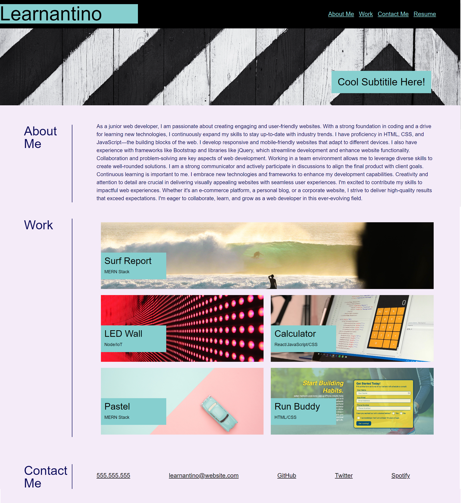

# Personal-Portfolio
## Description
The motivation behind this project was to create a personal website that serves as an introduction to myself, showcases my portfolio of work, and provides contact information. The goal was to create a professional online presence where potential clients, employers, or collaborators can learn about my skills, view my past projects, and easily get in touch with me.

By building this project, I aimed to solve the problem of effectively presenting myself and my work in a centralized and easily accessible manner. With a personal website, I can provide a comprehensive overview of my skills, experience, and achievements, allowing visitors to quickly assess my capabilities and determine if I am a good fit for their needs.

Throughout the development process, I learned various aspects of web design and development. I gained hands-on experience in using HTML and CSS to create a visually appealing and responsive website. I also learned about the importance of user experience (UX) design, ensuring that the website is intuitive, easy to navigate, and provides a seamless experience for visitors. Additionally, I acquired knowledge on how to effectively showcase my portfolio and present my contact information in a clear and accessible manner.

Overall, this project provided me with the opportunity to demonstrate my skills, create an online presence, and showcase my work. It allowed me to apply my knowledge in web development and UX design, and I gained valuable insights into creating an effective personal website that represents me professionally.

- [Installation](#installation)
- [Usage](#usage)
- [Credits](#credits)
- [License](#license)
- [Badges](#badges)

## Installation
- produce a reospiteory on GitHUB
- cloned the repository on my Desktop using the SSH Key
- Customised the content of the website by modifying the HTML and CSS files

## Usage

## Credits
There were no collaborators for this project.

## License
MIT License

Copyright (c) 2023 Saad Siddiqui

Permission is hereby granted, free of charge, to any person obtaining a copy
of this software and associated documentation files (the "Software"), to deal
in the Software without restriction, including without limitation the rights
to use, copy, modify, merge, publish, distribute, sublicense, and/or sell
copies of the Software, and to permit persons to whom the Software is
furnished to do so, subject to the following conditions:

The above copyright notice and this permission notice shall be included in all
copies or substantial portions of the Software.

THE SOFTWARE IS PROVIDED "AS IS", WITHOUT WARRANTY OF ANY KIND, EXPRESS OR
IMPLIED, INCLUDING BUT NOT LIMITED TO THE WARRANTIES OF MERCHANTABILITY,
FITNESS FOR A PARTICULAR PURPOSE AND NONINFRINGEMENT. IN NO EVENT SHALL THE
AUTHORS OR COPYRIGHT HOLDERS BE LIABLE FOR ANY CLAIM, DAMAGES OR OTHER
LIABILITY, WHETHER IN AN ACTION OF CONTRACT, TORT OR OTHERWISE, ARISING FROM,
OUT OF OR IN CONNECTION WITH THE SOFTWARE OR THE USE OR OTHER DEALINGS IN THE
SOFTWARE.

## Badges

